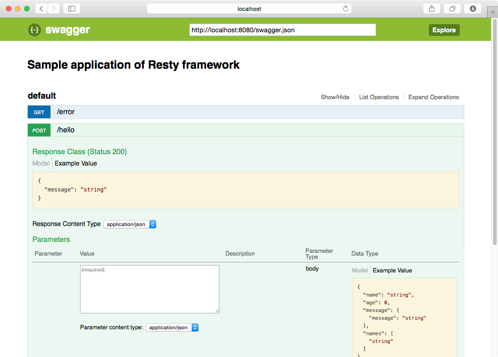
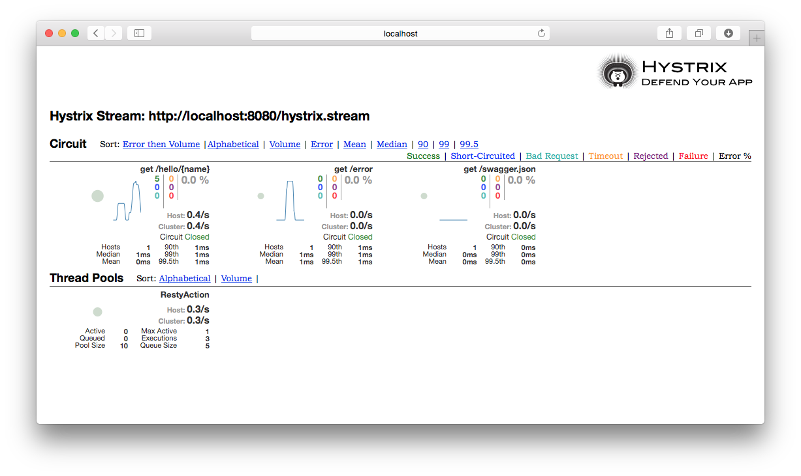

Resty
========

Super easy REST API framework for Scala

You can run the sample project by clone this repository and hit following command at the root directory:

```
sbt ~sample/jetty:start
```

Check APIs via Swagger UI at: `http://localhost:8080/swagger-ui/`.

##  Getting started

This is a simplest controller example:

```scala
class HelloController {
  @Action(method = "GET", path = "/hello/{name}")
  def hello(name: String): Message = {
    Message(s"Hello ${name}!")
  }
}

case class Message(message: String)
```

Define a web listener that registers your controller.

```scala
@WebListener
class InitializeListener extends ServletContextListener {
  override def contextDestroyed(sce: ServletContextEvent): Unit = {
  }
  override def contextInitialized(sce: ServletContextEvent): Unit = {
    Resty.register(new HelloController())
  }
}
```

Let's test this controller.

```
$ curl -XGET http://localhost:8080/hello/resty
{"message": "Hello resty!" }
```

## Swagger integration

Resty provides Swagger integration in default. Swagger JSON is provided at `http://localhost:8080/swagger.json` and also Swagger UI is available at `http://localhost:8080/swagger-ui/`.



## Hystrix integration

Resty also provides Hystrix integration in default. Metrics are published for each operations. The stream endpoint is available at `http://localhost:8080/hystrix.stream`. Register this endpoint to the Hystrix dashboard.



